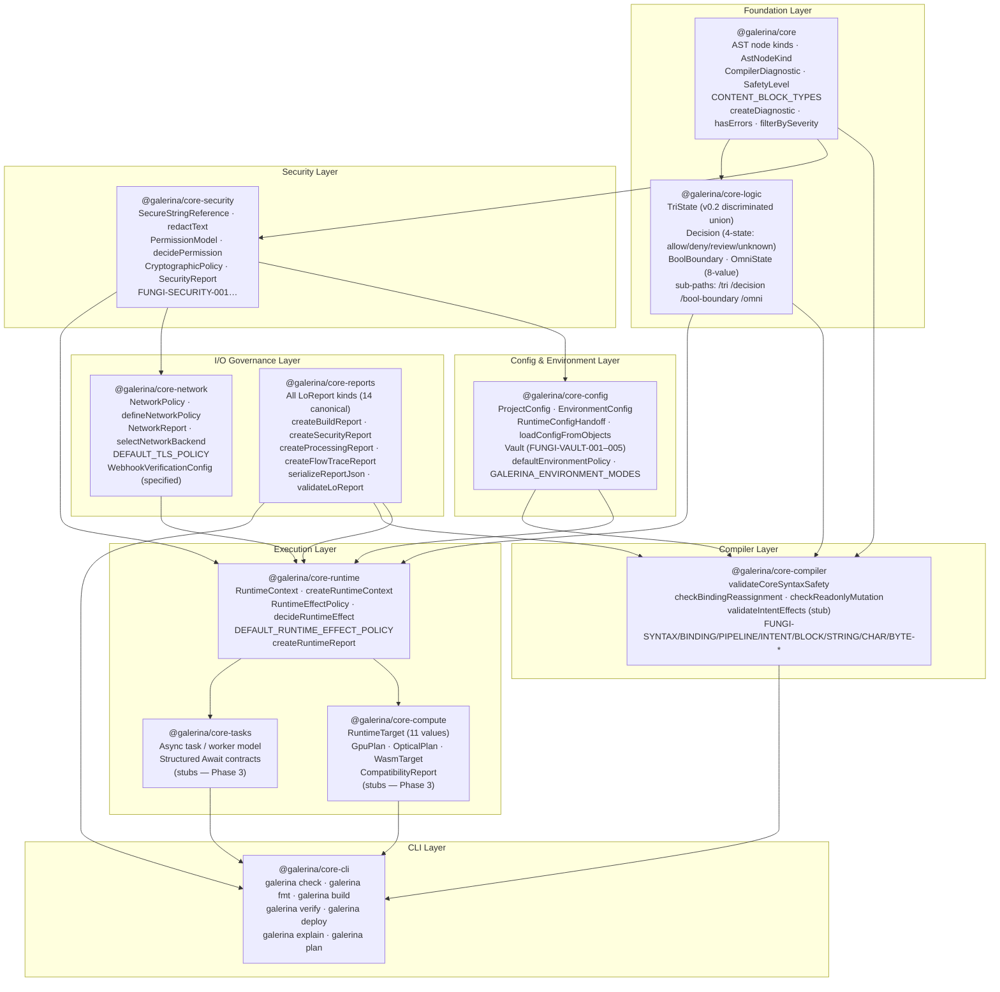
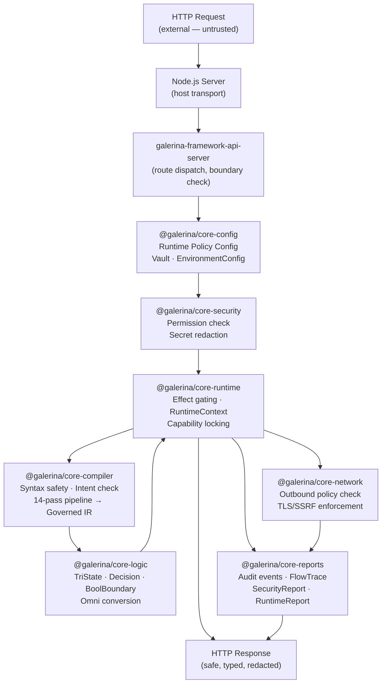
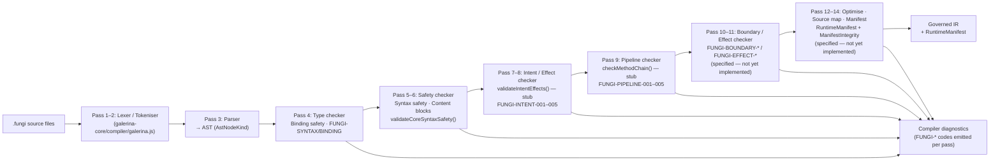

# Galerina Core Package Architecture

**Status:** Reference diagram  
**Scope:** `galerina-core*` package family — logical dependency graph and runtime data flow  
**Note:** Workspace package links (`@galerina/*` imports across packages) are pending; packages are currently standalone with types duplicated locally. These diagrams show the intended logical relationships.

---

## 1. Package Dependency Graph

The `galerina-core*` packages form a layered dependency graph: foundation types at the base, security and config above them, execution and I/O governance above those, and the CLI as the top-level orchestrator.

---

## 2. Runtime Data Flow

The current execution model is Node-hosted. Galerina governs execution through declared effects, capability checks, and policy enforcement — it does not bypass the host.

---

## 3. Compile-Time Pipeline Flow

Source `.fungi` files pass through the prototype parser (Stage 1, in `@galerina/core/compiler/`) and the compiler contract layer (`@galerina/core-compiler`). The 14-pass pipeline produces Governed IR and a RuntimeManifest.

---

## 4. Diagnostic Code Namespaces

Each package owns a diagnostic namespace. The `FUNGI-*` format is `FUNGI-SERIES-NNN`.

| Prefix | Owner | Count | Status |
|---|---|---|---|
| `FUNGI-SYNTAX-*` | `@galerina/core-compiler` | 002 | Implemented |
| `FUNGI-BINDING-*` | `@galerina/core-compiler` | 004 | Implemented |
| `FUNGI-PIPELINE-*` | `@galerina/core-compiler` | 005 | Constants only (stubs) |
| `FUNGI-INTENT-*` | `@galerina/core-compiler` | 005 | Constants only (stubs) |
| `FUNGI-BLOCK-*` | `@galerina/core-compiler` | 004 | Implemented |
| `FUNGI-STRING-*` | `@galerina/core-compiler` | 004 | Constants only |
| `FUNGI-CHAR-*` | `@galerina/core-compiler` | 004 | Constants only |
| `FUNGI-BYTE-*` | `@galerina/core-compiler` | 005 | Constants only |
| `FUNGI-EFFECT-*` | `@galerina/core-compiler` | 004 | Specified — not implemented |
| `FUNGI-BOUNDARY-*` | `@galerina/core-compiler` | 004 | Specified — not implemented |
| `FUNGI-TRI-*` | `@galerina/core-logic` | 005 | Implemented |
| `FUNGI-DECISION-*` | `@galerina/core-logic` | 005 | Implemented |
| `FUNGI-BOOL-BOUNDARY-*` | `@galerina/core-logic` | 005 | Implemented |
| `FUNGI-OMNI-*` | `@galerina/core-logic` | 005 | Implemented |
| `FUNGI-CONFIG-*` | `@galerina/core-config` | 027 | Partially implemented |
| `FUNGI-VAULT-*` | `@galerina/core-config` | 005 | Implemented |
| `FUNGI-NETWORK-*` | `@galerina/core-network` | 008 | Specified — not implemented |
| `FUNGI-WASM-*` | `@galerina/core-compute` | 004 | Specified — not implemented |
| `FUNGI-COMPAT-*` | `@galerina/core-compute` | 004 | Specified — not implemented |
| `FUNGI-REPORT-*` | `@galerina/core-reports` | 005 | Specified — not implemented |
| `FUNGI-PROOF-*` | `@galerina/core-reports` | 005 | Specified — not implemented |
| `FUNGI-DENIAL-*` | `@galerina/core-reports` | 004 | Specified — not implemented |
| `FUNGI-EVIDENCE-*` | `@galerina/core-reports` | 004 | Specified — not implemented |
| `Galerina_RUNTIME_*` | `@galerina/core-runtime` | (open) | Implemented |
| `Galerina_SECURITY_*` | `@galerina/core-security` | (open) | Implemented |
| `Galerina_NETWORK_*` | `@galerina/core-network` | (open) | Implemented |
| `Galerina_REPORT_*` | `@galerina/core-reports` | (open) | Implemented |
| `Galerina_COMPILER_*` | `@galerina/core-compiler` | (open) | Implemented (scanner codes) |

---

## 5. Test Coverage Summary (2026-05-26)

| Package | Tests | Status |
|---|---|---|
| `@galerina/core` | 9 | All passing |
| `@galerina/core-compiler` | 20 | All passing |
| `@galerina/core-logic` | 51 | All passing |
| `@galerina/core-config` | 17 | All passing |
| `@galerina/core-security` | 14 | All passing |
| `@galerina/core-network` | 12 | All passing |
| `@galerina/core-reports` | 15 | All passing |
| `@galerina/core-runtime` | 12 | All passing |
| `@galerina/core-compute` | 5 | All passing |
| `@galerina/core-cli` | 6 | All passing |
| **Total** | **161** | **All passing** |
