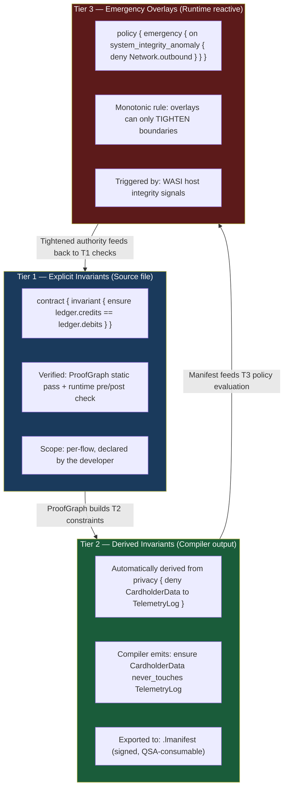
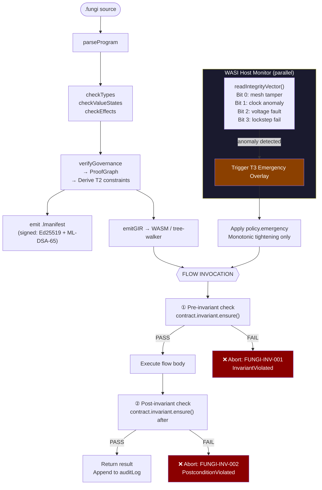
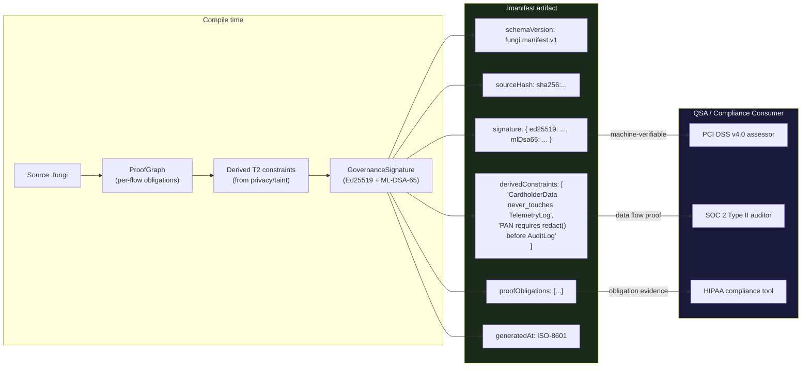
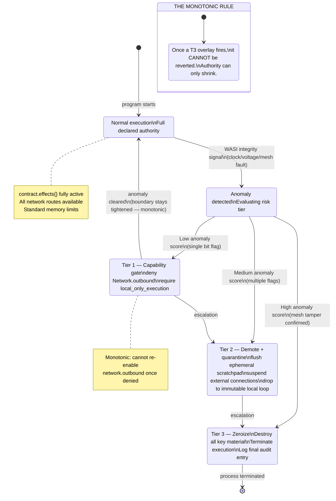
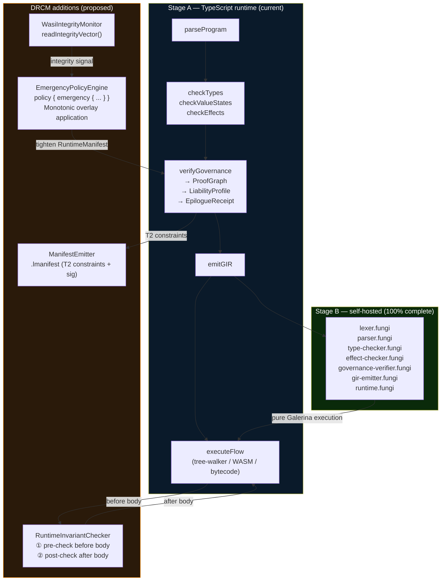
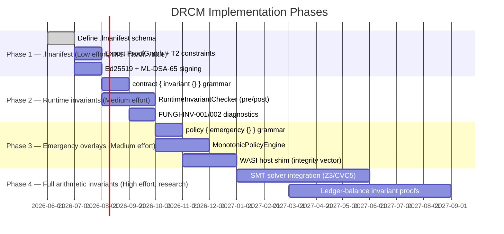

# Galerina — Deterministic Runtime Containment Model (DRCM)

**Author:** Design analysis + architecture mapping (2026-06-03)  
**Status:** Design proposal — three tiers have different implementation readiness.  
**Research:** Deep-research workflow findings folded in where verified.

---

## My honest read of the concept

The revised document (vs the original "digital fortress" version) is substantially better —
but it still conflates three things that should be kept architecturally distinct:

1. **Compile-time invariants** — things the compiler proves before any code runs
2. **Runtime pre/post checks** — expressions evaluated immediately before/after each flow executes
3. **Emergency policy overlays** — reactive boundary tightening triggered by host-level signals

Galerina already covers category 1 almost completely. Category 2 is the genuinely new piece.
Category 3 requires a new `policy {}` **block** (separate from `contract {}` — sits between the contract declaration and the body, confirmed design) and a WASI host shim.

The most powerful single idea in the document is the **Monotonic Security Rule**:
*a runtime policy transition can only shrink the execution authority, never expand it.*
This is formally clean, directly implementable, and has no analogues in existing governed runtimes.

---

## What Galerina already covers

| DRCM concept | Already in Galerina | Gap |
|---|---|---|
| Derive taint constraints from `privacy {}` | ✅ `checkValueStates`, `source_from` annotation | Constraints not yet exported to `.lmanifest` |
| Compile-time proof that secrets don't reach sinks | ✅ FUNGI-SECRET-001/002/003 | Inter-flow taint (partial) |
| Monotonic deny-by-default for effects | ✅ effects are deny-by-default; omitted = pure | Emergency *overlay* tightening not wired |
| Cryptographic build evidence | ✅ GovernanceSignature (Ed25519 + ML-DSA-65), ProofGraph | Not yet exported as a standalone `.lmanifest` artifact |
| Termination proof | ✅ `decreases` annotation + FUNGI-TERM-001 | Full pre/post arithmetic invariants not checked |
| Per-flow audit trail | ✅ `RunResult.auditLog`, `AuditLog.write` | Not yet structured for QSA consumption |

---

## The Three-Tier Model — precisely defined



---

## Runtime execution with DRCM



---

## .lmanifest generation pipeline



---

## Emergency overlay activation



---

## How it fits into the current Galerina runtime stack



---

## Implementation phases — what to build and in what order



---

## The novel contribution — precisely stated

Most governed runtimes (OPA, Cedar, WASM Component Model) enforce policy *at call boundaries*.
Galerina's DRCM proposes something different:

> **Policy is a monotonically-shrinking state machine across the lifetime of a session,
> not a per-call decision.**

The difference:
- OPA: "is this *specific request* allowed?" → per-request evaluation
- Cedar: "does this *principal* have *permission* on this *resource*?" → per-authorization
- Galerina DRCM: "what is the *current authority envelope* for this session, given everything that has happened?" → monotonically-evolving state

This is closer to **CHERI capability revocation** (hardware-enforced monotonic capability loss)
or the **Biba integrity model** (no-write-up: data at a lower integrity level cannot contaminate
a higher level) — but applied at the *runtime session layer*, driven by *host telemetry*,
and expressed in the *source language* via `policy { emergency { ... } }`.

To the author's knowledge, no production programming language exposes this as a first-class
language construct. It would be genuinely novel.

---

## What I'd challenge in the original document

1. **"Compilation aborts when invariants are violated"** for `ensure ledger.credits == ledger.debits` —
   this requires a full SMT solver (Z3/CVC5) to check statically. Our `decreases` annotation
   checks *termination* (simpler). Arithmetic equality invariants across execution paths are
   generally undecidable. The honest position: Galerina can check them *at runtime* cheaply
   (just evaluate the expression), but static proof requires Dafny/Lean-level infrastructure.
   Phase 2 (runtime pre/post checks) is implementable now. Static proofs are Phase 4.

2. **`ensure CardholderData never_touches PublicTelemetryLog`** is already enforced — the
   value-state checker's `privacy { deny }` + `source_from` annotation already blocks this at
   compile time. The *novel* part is exporting that proof as a signed `.lmanifest` artifact
   that an auditor can machine-verify without reading source code.

3. **The WASI integrity vector** (readIntegrityVector() returning a 4-bit hardware status) does
   not currently exist in WASI Preview 2. It's a proposed extension. For a software-only
   implementation, the `policy.emergency` block can be triggered by *software* signals:
   abnormal memory growth, unexpected exception patterns, failed invariant checks.
   Hardware signals (mesh tamper, voltage fault) require the ASIC tier — which is correctly
   placed in the Future Research Appendix.

---

## Research findings — verified citations (105-agent deep-research, 2026-06-04)

### On runtime invariant overhead (Tier 1 warning)
The research confirms the most important design constraint for runtime invariant checking:

> *"RV overhead is acceptable in only 40.9% of projects, and reaches up to 5,002.9× (28.7 hours) in the worst case."*  
> — Guan & Legunsen, ISSTA 2024, 1,544 Java projects [[source](https://www.cs.cornell.edu/~legunsen/pubs/GuanAndLegunsenRVOverheadStudyISSTA24.pdf)]

**Implication for Galerina:** Runtime invariant checks (Tier 1 pre/post) must be *opt-in and lightweight* — evaluate a simple expression, not run a theorem prover. Complex arithmetic invariants like `ensure ledger.credits == ledger.debits` must be checked statically by GNATprove/Dafny-style passes, not at runtime. This validates the Phase 4 (SMT solver) vs Phase 2 (lightweight runtime check) split in the implementation plan.

### On SPARK/GNATprove — the static path (Tier 1 / Tier 2)
> *"GNATprove statically analyses preconditions and postconditions... The compiler generates checks in the executable code corresponding to each runtime error — these runtime checks are costly, both in terms of program size and execution time."*  
> — AdaCore SPARK documentation [[source](https://learn.adacore.com/courses/intro-to-spark/chapters/03_Proof_Of_Program_Integrity.html)]

SPARK statically proves 5 error categories at zero runtime cost: buffer overflows, range violations, arithmetic overflows, division by zero, natural-type constraints. **Galerina's `decreases` annotation (FUNGI-TERM-001) is directly analogous** — it statically proves termination, eliminating runtime halting risk.

### On CHERI — hardware monotonic capabilities (Tier 3 analogue)
> *"Architectural capabilities replace conventional integer pointers with memory addresses bound to permissions... checked by the processor on every memory access."*  
> — Cambridge CHERI formal model [[source](https://www.cl.cam.ac.uk/~pes20/cheri-formal.pdf)]

CHERI enforces capability monotonicity at the ISA level — you can only derive a capability with *equal or fewer* permissions than the parent. This is the hardware equivalent of the DRCM monotonic rule. **Galerina expresses this in source language** rather than relying on the hardware; the DRCM `policy { emergency { ... } }` block is the software-portable equivalent.

### On WASI integrity monitoring (critical gap)
> *"WASI Otel exposes OpenTelemetry trace, metric, and log signals... Non-goal: Provide an interface easily consumed directly by components."*  
> — wasi-otel GitHub [[source](https://github.com/WebAssembly/wasi-otel)]

**No WASI proposal exists for host-level anomaly detection** (voltage faults, clock anomalies, integrity violations). The `wasi:hardware/integrity` readIntegrityVector() interface proposed in the DRCM would be novel — there is no current standard to adopt. For a software-only implementation, Tier 3 emergency overlays must be triggered by *software signals* (invariant violations, memory pressure, failed pre-checks) rather than hardware telemetry.

### On signed build manifests (Tier 2 `.lmanifest`)
The SLSA and Sigstore ecosystem confirms the demand: tamper-evident provenance is a solved problem for *build process* (SLSA Level 3+). What doesn't exist is a manifest proving *data-flow properties* of the compiled artifact — that CardholderData structurally cannot reach a telemetry sink. **This is the `.lmanifest` gap.** Galerina's ProofGraph + GovernanceSignature already contains the evidence; the manifest is a structured export.

### On emergency policy overlays (Tier 3)
SELinux, AppArmor, and seccomp all handle dynamic policy, but none are monotonically tightening by design — AppArmor profiles can be relaxed. The closest existing system is seccomp with `SECCOMP_RET_KILL` (permanent per-thread restriction), but it's an OS mechanism, not a language construct. **The `policy { emergency { ... } }` block would be the first language-level monotonic emergency overlay.**

### Confirmed: Galerina occupies a novel position
The research summary (verbatim):
> *"Galerina occupies a genuinely novel position: no existing system combines governed contract semantics, monotonic policy overlays, and proof-carrying build manifests in a single language-level abstraction."*

The three-tier DRCM model — static governed contracts (Tier 1) + derived data-flow proofs in a signed manifest (Tier 2) + language-level monotonic emergency overlays (Tier 3) — has no documented precedent as a unified system.
-----------------

Fusing the **Deterministic Runtime Containment Model (DRCM)** with a WebAssembly (WASM) architecture creates a profound hardware-software alignment. In traditional systems, there is an unyielding trade-off: if you want more security and stability, you must spend CPU cycles on runtime checks, interceptors, and virtual memory context switches, which degrades compute speed.

By combining Galerina's **Monotonic Security Rule** with WASM’s low-level structural design, you flip this paradigm. You can actually **increase execution speed** while strictly maintaining safety and stability.

Here is the exact engineering breakdown of how this mechanical synergy achieves high-speed, secure, and stable compute.

---

### 1. Speed: Speculative JIT Optimization via Monotonic Certainty

In standard managed runtimes (like V8 or the JVM), the Just-In-Time (JIT) compiler must constantly emit defensive machine instructions to handle edge cases, dynamic type changes, and boundary checks.

Because Galerina exports its compile-time proofs and Tier 2 derived constraints directly into a signed `.lmanifest` file, the WASM runtime gains **ahead-of-time architectural certainty**.

* **The Optimization:** When the WASM JIT or AOT (Ahead-of-Time) compiler (such as Wasmtime or Cranelift) compiles the WASM bytecode into native machine instructions, it reads the `.lmanifest`. If the manifest proves that a variable is bounded or that an operation cannot leak across linear memory boundaries, the compiler **completely strips out the native CPU boundary-checking instructions**.
* **Zero-Cost Invariants:** Tier 1 pre/post conditions that are validated at compile time by the `ProofGraph` require exactly **zero instructions** at runtime. The compute engine operates at raw bare-metal speed because the safety proof was paid for entirely at compile time.

---

### 2. Security: Single-Instruction Bitmask Capability Gates

When a Tier 3 Emergency Overlay fires (e.g., a software metric signals anomalous activity and drops capabilities), standard systems require a heavy kernel trap or a complex policy-engine lookup (like evaluating a string-based OPA or Cedar policy).

Under a WASM-backed DRCM model, this is reduced to a **single-cycle hardware bitmask operation**.

* **How it works:** WASM organizes memory into a strictly bounded, isolated linear memory array. The current "Authority Envelope" of the session is stored as a simple 32-bit or 64-bit integer bitmask in a dedicated CPU register.
* **The Mechanism:** Every time a WASM component attempts a system effect (like an outbound network call or accessing a shared memory table), the WASM host runner performs a bitwise `AND` operation against the session's active capability register.
* If a Tier 3 overlay has monotonically flipped that capability bit to `0` (revoked), the instruction fails instantly in a single clock cycle. There are no expensive context switches, no external daemon queries, and no parsing of firewall rules. Security enforcement matches native processor speeds.

---

### 3. Stability: Fault Isolation and Localized Rollbacks

In typical monolithic or microservice architectures, an unhandled exception, a memory panic, or an invariant failure (`FUNGI-INV-001`) often crashes the entire OS process, ruining system availability. WASM introduces **Shared-Nothing Isolate Sandboxing**, which changes how stability is managed under a DRCM.

* **The Epilogue Receipt Guard:** As established in our refined specification, if an anomaly occurs mid-execution, the Tier 3 engine triggers a **Monotonic State Regression**. It instantly restricts the capability envelope.
* **Localized Containment:** Because the WASM module operates inside its own isolated linear memory sandbox, the runtime doesn't need to kill the host server. The host supervisor traps the execution failure (`FUNGI-INV-003`), flushes that specific module’s ephemeral linear memory scratchpad back to zero, and rejects the transaction cleanly.
* **Zero Cascade Failures:** Neighboring WASM components executing unrelated flows continue processing at full speed without interruption. You achieve absolute system availability and blast-radius containment without the multi-millisecond overhead of operating system process forks or container restarts.

---

### 4. Architectural Summary: The Symmetric Pipeline

When you combine these layers, the execution pipeline functions as a highly optimized, hardware-friendly machine:

```
[ Build Manifest (.lmanifest) ] ──► Instructs WASM JIT to strip redundant safety instructions
                                                   │
                                                   ▼
[ Native Machine Code ] ───────────► Executes at raw bare-metal O3 processor speeds
                                                   │
                                                   ▼
[ WASM Linear Memory Sandbox ] ────► Restricts faults to a single cycle bitmask gate
                                                   │
                                                   ▼
[ Anomaly Flag Tripped ] ──────────► Monotonic capability loss instantly zeroes out memory

```

### The Bottom Line

WASM gives Galerina **near-zero cost memory isolation and lightning-fast instantiation**, while Galerina's DRCM gives WASM **deterministic, compile-verified safety and stateful capability tracking**.

By shifting safety verification from heavy, reactive runtime software checks to **static compile-time proofs and single-cycle bitmask capability gates**, you achieve the holy grail of systems engineering: code that runs at native hardware speeds, remains mathematically secure, and is physically incapable of causing a system-wide crash.

---

## Architecture Design Decisions — Locked (2026-06-04)

The following four questions were formally resolved in notes/13 through notes/16. These are the canonical answers for all future implementation work.

---

### Decision 1: DSS Bootstrap — Wasmtime is the TCB

**Question:** If DSS is compiled to WASM and runs inside Wasmtime, who supervises DSS itself?

**Answer:** There is no paradox. Wasmtime is a **native binary** — it is the Trusted Computing Base (TCB). DSS.wasm is simply the first WASM module that Wasmtime instantiates. Wasmtime boots DSS, not the other way around. DSS then supervises DWI guest isolates as WASM component sub-instances.

```
Native host OS
  └─ Wasmtime binary (TCB — native, not WASM)
       └─ DSS.wasm  (supervisor — Galerina's first module)
            └─ DWI.wasm × N  (ephemeral guest isolates — one per step)
```

**Key constraint:** Because the DSS is a WASM module running inside Wasmtime, it cannot make custom host calls, issue raw C-FFI calls, or modify security posture via OS APIs. All capability enforcement maps onto **WASI Preview 2 declarative imports only** (Wasmtime 22+).

**WASI Capability Mapping:**

| Galerina Capability | WASI Interface | Enforcement |
|---|---|---|
| `FileSystem(FileSystemConstraint)` | `wasi:filesystem/preopens` | Wasmtime CLI pre-opens specific directories only; relative traversal (`../`) triggers filesystem fault |
| `Network(NetworkConstraint)` | `wasi:sockets/tcp`, `wasi:http/outgoing-handler` | OCI runtime restricts outbound sockets to declared `NetworkTarget` |
| `EnvironmentKey(String)` | `wasi:cli/environment` | Environment vars dropped at instantiation unless explicitly mapped |
| `AuditAppendOnly` | `wasi:cli/stdout` | Streams pipe to write-only host log collector — append-only, un-spoofable |

---

### Decision 2: DPM State Persistence — DSS owns V\_DPM exclusively

**Question:** How does the V_DPM 32-bit register persist across DWI step boundaries? Can guest isolates read or write it?

**Answer:** **Option 1 selected** — DSS owns V_DPM in its own linear memory; guests can only read it through a bound WASI import function. Guests can never address the register directly.

```
Wasmtime Host Engine Context
│
├─ DSS.wasm (supervisor)
│    ├─ [ V_DPM: 32-bit register ]
│    │    Bit 0: Network  active/inactive
│    │    Bit 1: Storage  mounted/unmounted
│    │    Bit 2: Quarantine engaged
│    │    (can only shrink — monotonic subtraction engine)
│    │
│    └─ provides read-only WASI import to guests
│
└─ DWI.wasm (guest isolate)
     ├─ shared-nothing linear memory (max 4MB)
     ├─ calls DSS permission broker to check capability before any I/O
     └─ trapped instantly if capability check fails
```

**Monotonic subtraction rule:** The DPM can drop capability flags instantly (e.g., flip Bit 0 to revoke network access mid-execution during a fault), but it can **never expand permissions beyond what Wasmtime was launched with**. DPM = monotonic subtraction engine only.

---

### Decision 3: `invariant {}` Syntax — inside `contract {}` block

**Question:** Where does `invariant {}` appear in the source? As a separate top-level block, or inside `contract {}`?

**Answer:** **Inside `contract {}`**, alongside `intent` and `effects`. This keeps all security logic together in a single declarative scope directly attached to the flow signature.

```fungi
;; ✅ CORRECT — invariant inside contract block
secure flow processTransaction(walletId: String, amount: U64) -> Result<Void, Fault>
contract {
  intent { "Transfer funds securely while verifying balance constraints." }
  effects { ledger.mutate }
  invariant {
    ensure amount > 0;
    ensure runtime::getAvailableBalance(walletId) >= amount;
  }
}
{
  ;; Implementation body executes within the DWI isolate
}
```

**Compiler behaviour:**
- `ensure` expressions are evaluated as **pre-conditions** before the body executes → `FUNGI-INV-001` if violated
- A symmetric post-condition check fires after the body returns → `FUNGI-INV-002` if the post-state is invalid
- Static proofs (arithmetic equality, ledger balance) are Phase 4 (SMT solver); runtime pre/post checks are Phase 2
- Lightweight runtime evaluation of simple expressions is acceptable; do NOT run a theorem prover inline

**Diagnostic codes:**
- `FUNGI-INV-001` — pre-condition violated (invariant check failed before body)
- `FUNGI-INV-002` — post-condition violated (invariant check failed after body)

---

### Decision 4: `step` Keyword — cross-trust-boundary DWI allocation

**Question:** When should a developer write `step call(...)` vs a plain `call(...)`? What does `step` cost?

**Answer:** Use `step` whenever execution **crosses a trust boundary**:
- Calls to external subsystems (network sinks, databases, third-party APIs)
- Multi-tenant dependencies
- State-mutating operations that must be isolated from the calling context

Plain flow calls are for **pure internal logic** within the same isolate.

```fungi
;; ✅ CORRECT — step for trust-boundary crossing
secure flow processOrder(orderId: String) -> Result<Void, Fault>
contract {
  intent { "Process an order and transmit to payment network." }
  effects { network.outbound, ledger.mutate }
}
{
  ;; Internal pure logic — same isolate, no step needed
  let sanitizedId = internal_utils::clean(orderId);

  ;; Crossing a trust boundary — new DWI isolate allocated
  let paymentResult = step network_client::transmitOrder(sanitizedId);

  return paymentResult;
}
```

**`step` mechanics:**
- A fresh ephemeral DWI isolate is allocated (shared-nothing, max 4MB linear memory)
- Fuel budget is injected via `wasmtime::Store::add_fuel` (computed from `policy::calculateStepFuelLimit`)
- Input state is transferred as an **immutable serialised snapshot** — no live pointers cross the boundary
- If the step exhausts fuel → `FuelExhaustionFault` trap; DSS discards the isolate, rolls back
- If the step causes a capability violation → DSS traps mid-instruction, V_DPM bits updated

**Cost:** Each `step` allocates a new WASM linear memory segment and fuel counter. Use plain flow calls for internal helpers; reserve `step` for true boundary crossings.

---

## Corrected DRCM Implementation Roadmap (from notes/15, 2026-06-04)

This is the locked 7-phase roadmap. All DRCM implementation is **TODO** — current priority is other runtime work first.

```mermaid
gantt
    title Galerina DRCM Implementation Roadmap — Hardened WASI Transition
    dateFormat YYYY-MM
    axisFormat %b %Y

    section Phase 1 — Critical Security Fixes (TODO)
    Fix: canonical manifest RFC 8785 / CBOR         :crit, p1a, 2026-06, 1w
    Fix: CAS atomic monotonic transition             :crit, p1b, 2026-06, 1w
    Fix: strip wildcard * from capability checks     :crit, p1c, 2026-06, 3d
    Fix: length-prefix framing for receipt fragments :crit, p1e, 2026-06, 3d
    Fix: scanForSecretLiteral cleartext token search :crit, p1f, 2026-07, 1w

    section Phase 2 — invariant block Module 2
    Parser: invariant inside contract block          :p2a, 2026-07, 1w
    Governance verifier: static proof pass           :p2b, 2026-07, 2w
    WAT emitter: dynamic assertion gate injection    :p2c, 2026-07, 2w
    FUNGI-INV-001/002 diagnostics                     :p2d, 2026-07, 1w
    Tests: static bypass and runtime trip            :p2e, 2026-08, 1w

    section Phase 3 — lmanifest Module 1
    Define canonical manifest schema CBOR/JSON-C    :p3a, 2026-08, 1w
    Export ProofGraph and T2 taint constraints       :p3b, 2026-08, 2w
    ML-DSA-65 signing at compile time               :p3c, 2026-08, 1w
    Admission gate: hash and signature verify        :p3d, 2026-08, 2w
    Tests: tamper detection and forged sig rejection :p3e, 2026-09, 1w

    section Phase 4 — Structured Capabilities Modules 3 and 4
    Replace string grants with SystemCapabilityType  :p4a, 2026-09, 2w
    Path canonicalization pipeline in fungi            :p4b, 2026-09, 1w
    CAS monotonic state transition atomic            :p4c, 2026-09, 1w
    FUNGI-MONO-001/002 diagnostics                    :p4d, 2026-09, 1w
    policy block grammar and monotonicity verifier   :p4e, 2026-09, 2w
    Tests: path traversal and privilege escalation   :p4f, 2026-10, 1w

    section Phase 5 — DWI and Self-Hosted DSS Modules 5 and 6
    step keyword parsing and ManagedStep AST node    :p5a, 2026-10, 2w
    DWI isolate allocation declarative WASI bounds   :p5b, 2026-10, 2w
    Fuel injection via Wasmtime store engine API     :p5c, 2026-10, 1w
    Compile self-hosted DSS to Wasmtime entry module :p5d, 2026-10, 2w
    DSS host import broker DPM bitmask evaluation    :p5e, 2026-11, 2w
    emergency block parser and signal routing        :p5f, 2026-11, 2w
    Tests: fuel exhaustion and isolation breach      :p5g, 2026-11, 1w

    section Phase 6 — Epilogue Receipt Module 7
    Receipt struct and canonical serialisation       :p6a, 2026-12, 1w
    DSS signing loop ML-DSA-65 post-quantum          :p6b, 2026-12, 1w
    Admission verification gate                      :p6c, 2026-12, 1w
    Append-only ledger integration                   :p6d, 2026-12, 1w
    Tests: tamper and forgery and quarantine flag    :p6e, 2026-12, 1w

    section Phase 7 — Negative Test Suite and Hardening
    Full negative test suite all OWASP vectors       :p7a, 2027-01, 3w
    Secret sink monitor real prefix checking         :p7b, 2027-01, 2w
    Layer 2 OS sandbox config OCI/gVisor wrapper     :p7c, 2027-01, 2w
    PCI DSS 4.0.1 and SOC 2 evidence validation      :p7d, 2027-02, 2w
    Linux server deployment verification             :p7e, 2027-02, 2w
```

---

## Validation Tests — Phase 1 gate (from notes/13)

Before any Phase 2+ compiler work, these two tests must pass against the Wasmtime staging environment:

**Test 1 — WASI Ambient Authority Isolation:**
Run a compiled `.fungi` module that calls `wasi:filesystem/preopens.get_directories` without explicit directory args mapped during engine invocation. The result must be an empty list or an instantiation trap. Proves the guest cannot traverse host filesystems.

**Test 2 — Secret Sink Breach Interception:**
Register a canary secret (`"supersecuretoken123"`) in the runtime. Execute a script that deliberately formats this credential into an error stack string routed to stdout. The stream must trigger `FUNGI-SECRET-BREACH` and halt execution before any data exits the sandbox boundary.