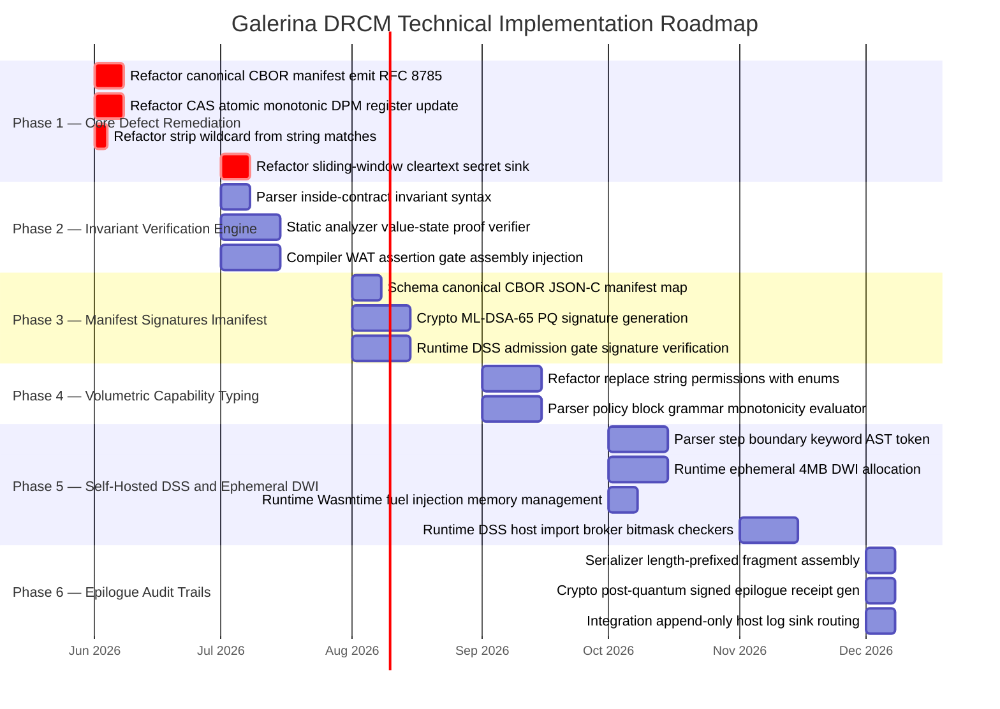

# Galerina — Engineering Goals & Master Plan

**Version:** 1.0 (2026-06-04)  
**Source:** notes/21-goals  
**Purpose:** Defines the three architectural goals that constitute "done" for the Galerina platform. These are not aspirational — each has specific verification prerequisites and acceptance tests. This document is the executive summary of the entire KB hierarchy.

---

## The Core Claim

> By moving verification away from heavy runtime wrappers and replacing them with static validation proofs and single-cycle bitmask gates, Galerina achieves code that runs at **native hardware speeds**, remains **mathematically secure**, and is **physically incapable of causing a system-wide crash**.

This is not a marketing statement. It is a **structural consequence** of three specific architectural choices:

1. The Governance Verifier + WAT assertion injection eliminates runtime overhead for proved invariants
2. The V_DPM 32-bit bitmask reduces capability checking to a single-cycle bitwise AND
3. The 4MB DWI shared-nothing isolates with hardware guard pages contain faults to a single thread

Each claim has testable prerequisites below.

---

## Goal A — Native Hardware Speed Execution

**Target:** Code compiles and runs without runtime performance penalties or active out-of-band monitoring loops.

```
Galerina Source (.fungi)
       │
       ▼
Compiler Pipeline
  - Governance Verifier: static proof pass
  - WAT Assertion Gate Injector: injects only what cannot be proved statically
       │ emits bytecode
       ▼
Wasmtime Cranelift JIT
  - Translates WASM bytecode → native x86_64 / AArch64 assembly at initialisation
       │
       ▼
Native CPU Hardware
  - Executes high-speed assembly jumps directly
  - Zero-overhead security enforcement (proved invariants = zero runtime cost)
```

### Verification Prerequisites

1. **Static Proof Pass** — the compiler's Governance Verifier must analyse type definitions, parameter boundaries, and state mutations before execution. If a loop's bounds can be determined at compile time, no runtime check branches are emitted.

2. **Direct JIT Translation** — Wasmtime must compile `.wasm` to native machine instructions upon initialisation (Cranelift AOT/JIT). No interpreter fallback for production paths.

3. **WAT Assertion Injection** — when value ranges cannot be fully proved statically, the compiler injects WAT assertions directly into the bytecode stream. These translate to fast CPU conditional jump instructions (`cmp` + `jne`), offloading enforcement to the host processor. There is no software checking layer.

### Acceptance Test (T-006)

Run a Wasmtime benchmark of a compiled `.fungi` flow against an equivalent hand-written WAT module with no governance overhead. The performance delta must be ≤ 5% for flows where all invariants are statically proved. This validates that the static proof pass eliminates — not just amortises — runtime overhead.

---

## Goal B — Single-Cycle Bitmask Capability Gating

**Target:** System call authorization resolves via low-level bitwise arithmetic inside the host engine, with no string parsing, no policy engine lookups, no kernel traps.

```
Guest DWI isolate attempts network.outbound call
       │
       ▼
DSS import broker intercepts
       │ bitwise AND
       ▼
Isolate request bitmask:  0000 0001  (network.outbound)
Current V_DPM register:  1111 1100  (network bit cleared by quarantine)
─────────────────────────────────────
AND result:              0000 0000  → IMMEDIATE HARDWARE TRAP
```

### Verification Prerequisites

1. **Monotonic Subtraction Rule** — permissions can only decrease: σ(t+1) ⊑ σ(t). The system can never add new capabilities at runtime. This is enforced by M-001.

2. **Sovereign 32-Bit Vector** — V_DPM is stored as a single un-addressable 32-bit register inside the private linear memory of DSS.wasm. Sibling DWI guest isolates cannot address or read this register. This is enforced by I-002.

3. **Bitwise Mediation Logic** — when a guest isolate calls an imported resource function, the DSS broker validates the request using a single-cycle bitwise AND against the active register. If the result is zero, a hardware trap fires instantly — no string parsing, no database lookup, no policy engine call.

### Acceptance Test (T-007)

Register a DWI guest isolate with V_DPM = 0b11111110 (network bit cleared). Attempt a `network.outbound` call from the guest. Verify:
- The call is trapped before any data exits the sandbox
- The trap fires in ≤ 1 CPU instruction cycle (measurable via Wasmtime trap metrics)
- V_DPM does not change (trap is not a permission grant)
- A subsequent attempt with V_DPM = 0b11111111 (network active) succeeds

---

## Goal C — Structural Prevention of System-Wide Crashes

**Target:** A fault, resource exhaustion, or security breach inside an individual workflow step terminates that instance immediately without affecting the supervisor loop, adjacent steps, or the host process.

### Verification Prerequisites

1. **Shared-Nothing Guard Segments** — Wasmtime initialises each `step` inside an ephemeral DWI bounded by a 4MB linear memory ceiling. These heaps are separated using hardware virtual memory guard pages (2GB boundaries). Pointer traversal or cross-instance memory access is physically impossible, not policy-enforced.

2. **Instruction Fuel Allocation** — the DSS supervisor injects a precise fuel budget into the Wasmtime store before starting an isolate. If the guest attempts an infinite loop, it exhausts fuel and triggers an internal runtime trap — not a process crash.

3. **Signal Routing & Recovery** — when a guest isolate faults or exhausts fuel, the host engine intercepts the exception, safely reclaims the 4MB heap, and routes the signal to the DSS Signal Router. The supervisor either:
   - Executes fallback logic
   - Triggers the `emergency {}` policy block
   - Updates V_DPM (monotonic capability drop)
   
   The main host process and all other DWI instances continue executing without interruption.

### Acceptance Test (T-008)

Run three DWI instances concurrently:
- Instance A: well-formed flow
- Instance B: infinite loop (fuel exhaustion test)
- Instance C: path traversal attempt (capability violation test)

Verify:
- Instance B exhausts fuel and is terminated → FUNGI-RESOURCE-001
- Instance C is trapped → FUNGI-CAP-003
- Instance A completes successfully
- The DSS supervisor process remains running throughout
- V_DPM is updated for the Instance C violation (network/storage bit cleared)

---

## Documentation Map (Validation Hierarchy)

```
architecture-charter.md          Layer 0 — Invariant Principles
                                  (overrides everything)
       │ Enforces
       ▼
galerina-governance-rules.md       Layer 1 — Numbered Rules
                                  (FUNGI codes, compiler diagnostics)
       │ Governs
  ┌────┴────┐
  ▼         ▼
galerina-architecture-patterns.md  Layer 2A — Topology Layouts
galerina-contract-authoring-guide  Layer 2B — Language Syntax
       │ Realized via
       ▼
galerina-deterministic-runtime-    Layer 3 — Physical Runtime
containment.md                    (DSS, DWI, V_DPM, Wasmtime TCB)
```

**Conflict resolution:** Layer 0 overrides Layer 1 overrides Layer 2 overrides Layer 3. If a pattern contradicts a rule, the rule wins and the compiler emits a hard build fault.

---

## Comprehensive Engineering Roadmap



---

## Reference Contract: Full Stable + Experimental Syntax

The canonical example showing all 12 mediation categories together. Stable clauses compile today; `@experimental_profile(drcm_core_v1)` wraps Phase 2–5 syntax.

```fungi
secure flow processCorporateInvoicing(merchantId: String, invoiceBatch: List<Invoice>)
  -> Result<Void, Fault>
contract {
  intent { "Process multi-tenant client invoice batches securely." }
  effects { gateway.charge }

  types {
    type Invoice = { id: String, amount_cents: U64 }
  }

  request  { merchantId, invoiceBatch }
  response { Result<Void, Fault> }

  requires {
    SystemCapability.CallGate(
      module: "gateway",
      function: "charge_endpoint",
      enforce_tls: true
    )
  }

  economics {
    currency: "USD",
    max_billing_quota_per_call: 500_00,   ;; $500.00 max per invoke
    max_aggregate_flow_budget: 10000_00,  ;; hard cap on loop spending
    charge_failure_tolerance_ratio: 5     ;; 5% drop rate → DPM quarantine
  }

  audit {
    receipt_format: "canonical_cbor",
    signing_algorithm: "ml-dsa-65"
  }

  ;; Phase 2–5 features — parsed, verification skipped in --release:
  @experimental_profile(name: "drcm_core_v1", status: "planned_phase_2") {
    invariant {
      ensure List.length(invoiceBatch) > 0;
      ensure List.length(invoiceBatch) <= 1000;
    }
  }

  @experimental_profile(name: "drcm_core_v1", status: "planned_phase_5") {
    limits {
      max_memory: 4MB,
      max_instructions: 5_000_000
    }
  }
}
{
  ;; Ephemeral business logic executes within the DWI here
  return Ok(Void)
}
```

---

## Interim Boundary Pattern (Pre-DRCM Phase 5)

Until `step` ships (DRCM Phase 5), all cross-boundary calls use the `security::interim::BoundaryProxy`:

```fungi
;; Source: packages-galerina/galerina-core-security/src/interim.fungi
secure flow processOrderOutbound(orderId: String) -> Result<Void, Fault>
contract {
  intent { "Transmit order data via an interim validated boundary channel." }
  effects { network.outbound }
  requires {
    SystemCapability.CallGate(
      module: "network_client",
      function: "transmitOrder",
      enforce_tls: false
    )
  }
}
{
  let sanitizedId = internal_utils::clean(orderId)

  let receipt = security::interim::pre_flight_check(
    "order_processor",                  ;; Position 0: caller
    "network_client::transmitOrder",    ;; Position 1: target
    String.length(sanitizedId)          ;; Position 2: payload_size_bytes
  )
  if (!receipt.is_approved) { return receipt.fault_code }

  let result = network_client::transmitOrder(sanitizedId)
  security::interim::post_flight_cleanup(receipt)
  return result
}
```

When DRCM Phase 5 ships, this becomes:

```fungi
@experimental_profile(name: "drcm_core_v1", status: "planned_phase_5") {
  let result = step network_client::transmitOrder(sanitizedId)
}
```

---

## Phase 1 Validation Gate

Before any Phase 2+ compiler work begins, both acceptance tests must pass:

**Test 1 — WASI Filesystem Traversal Block:**  
Compile a module that calls `wasi:filesystem/preopens.get_directories` without explicit dir args. Must return empty list or instantiation trap. Proves ambient filesystem authority is not available.

**Test 2 — Cleartext Secret Sink Interception:**  
Register canary prefix `"supersec"` in SecretSinkCache. Run a module that prints an error trace containing `"supersecretkey123"`. Must trigger FUNGI-SECRET-BREACH and halt before any data exits the sandbox.

Both tests PASS only when the system REJECTS or TRAPS. Silent success is a bug.

---

## Cross-References

| Document | Role |
|---|---|
| `KNOWLEDGE-BASE-INDEX.md` | Master navigation guide |
| `architecture-charter.md` | Principles (Layer 0) |
| `galerina-governance-rules.md` | Hard rules — all FUNGI codes |
| `galerina-architecture-patterns.md` | 9 patterns + feature profiles |
| `galerina-contract-authoring-guide.md` | contract {} syntax reference |
| `galerina-deterministic-runtime-containment.md` | DRCM 7-module architecture |
| `packages-galerina/galerina-core-security/src/interim.fungi` | BoundaryProxy implementation |
