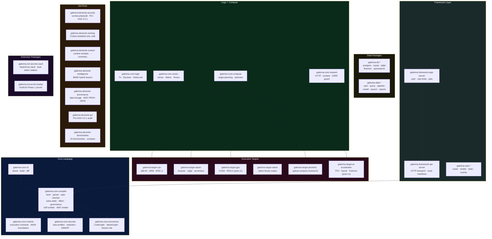
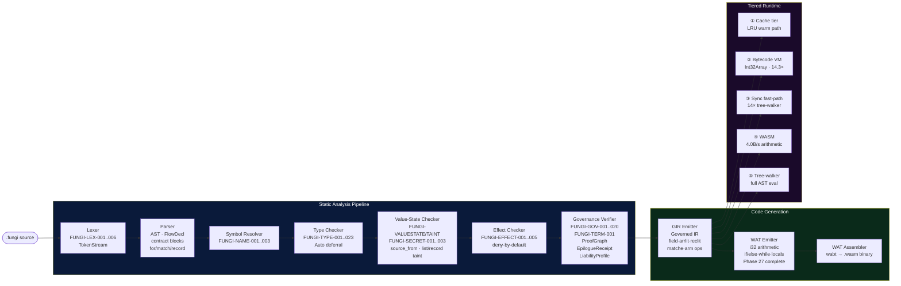
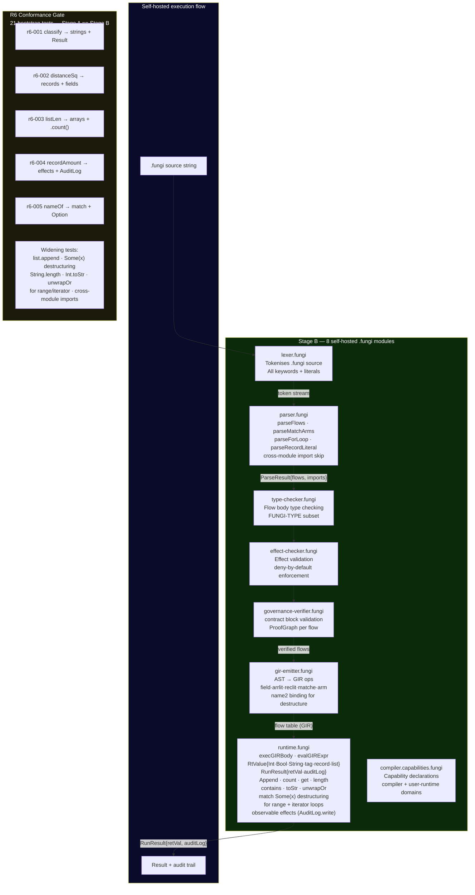
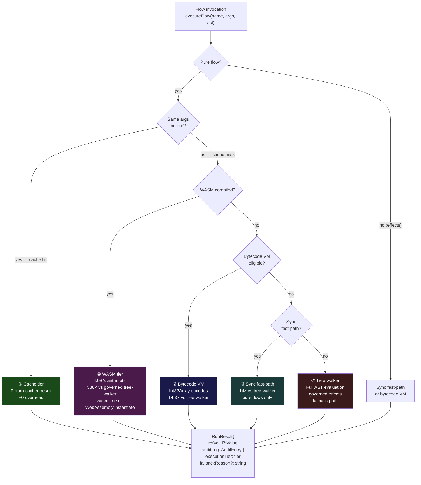
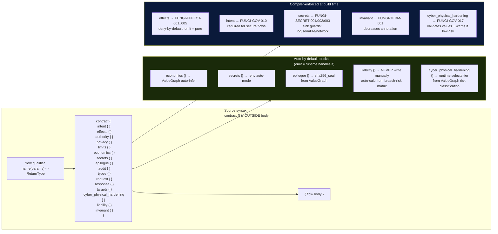
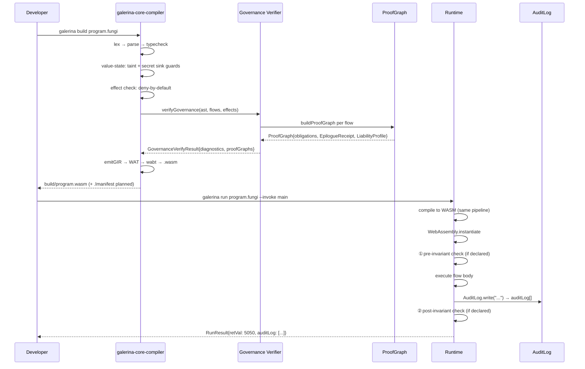
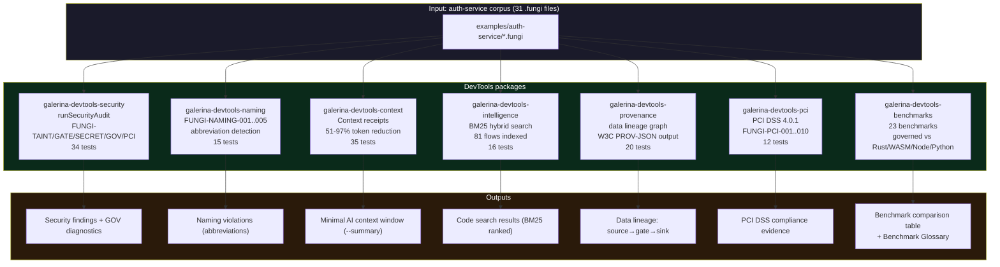

# Galerina — Runtime and Component Structure

Mermaid diagrams showing the full package layout, compiler pipeline, execution tiers, and self-hosted runtime.

---

## 1. Full Package Ecosystem

---

## 2. Compiler Pipeline (Stage A)

---

## 3. Stage B — Self-Hosted Runtime (100% complete)

---

## 4. Execution Tier Selection

---

## 5. Contract Block Architecture

---

## 6. Data Flow Through the Governed Pipeline

---

## 7. DevTools Ecosystem

