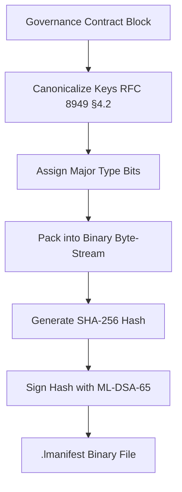

# LogicN — CBOR .lmanifest Specification

**Version:** 1.0 (2026-06-04)  
**Source:** notes/27-CBOR (RFC 8949)  
**Status:** Specification — current implementation uses RFC 8785 canonical JSON as an intermediate. Full CBOR binary encoding is the target (DRCM Phase 3).

---

## Why CBOR — Not JSON

JSON is ambiguous: key ordering varies between parsers, whitespace differs, Unicode encoding is inconsistent. If two parsers serialize the same contract differently, the `ML-DSA-65` cryptographic hash changes and the signature fails.

**CBOR (RFC 8949) solves this:**

| Property | Why it matters for LogicN |
|---|---|
| **Self-describing** | Binary contains its own length + type info — `DSS.wasm` doesn't guess structure |
| **Canonical ordering** | RFC 8949 §4.2 dictates fixed key order — same manifest always produces identical hash |
| **Efficiency** | Single byte for small ints/strings — ProofGraph is 30-40% smaller than minified JSON |
| **CBOR Tags** | Custom type identifiers — `DSS.wasm` skips unknown data while identifying critical capabilities |

---

## CBOR Binary Anatomy

Every CBOR object: 3-bit **Major Type** + 5-bit **Additional Information**

| Major Type | Binary | Meaning |
|---|---|---|
| 0 | `000` | Unsigned integer |
| 1 | `001` | Negative integer |
| 2 | `010` | Byte string |
| 3 | `011` | Text string |
| 4 | `100` | Array |
| 5 | `101` | Map |
| 6 | `110` | Tag (custom type identifier) |
| 7 | `111` | Primitive (true/false/null/float) |

---

## .lmanifest Encoding Example

```json
// LogicN contract (conceptual)
{ "effect": "gateway.charge", "limit": 4194304 }
```

**CBOR binary encoding:**

| Segment | Hex | Explanation |
|---|---|---|
| Map header | `A2` | Map of 2 entries |
| Key 1 | `66 65 66 66 65 63 74` | "effect" (text, 6 bytes) |
| Value 1 | `6E 67 61 74 65 77 79 2E 63 68 61 72 67 65` | "gateway.charge" (text, 14 bytes) |
| Key 2 | `65 6C 69 6D 69 74` | "limit" (text, 5 bytes) |
| Value 2 | `1A 00 40 00 00` | 4,194,304 (uint32, 4 bytes) |

**Total: ~35 bytes** vs ~50+ for minified JSON.

---

## LogicN Custom CBOR Tag Registry

CBOR Tag = Major Type 6, followed by the tagged value.

`DSS.wasm` uses tag numbers for constant-time dispatch: a `switch(tag)` statement routes each field to the correct handler without deep content inspection.

### Core Tags (Governance, Economic, Operational)

| Tag | LogicN Type | Purpose | Supervisor action |
|---|---|---|---|
| **400** | `Capability` | Resource authorisation bitmasks | V_DPM bitmask check — immediate trap on mismatch |
| **401** | `Effect` | Declared state-mutation tokens | Effect registry lookup + enforcement |
| **402** | `SecretHandle` | Opaque pointers to vault secrets | Route to SecretSinkMonitor — never log |
| **403** | `ProofObligation` | Cryptographic evidence required before execution | Static verification gate |
| **404** | `GovernanceSignature` | ML-DSA-65 + Ed25519 signature bundle | Admission gate signature verification |
| **405** | `DomainGuardRef` | Pointer to immutable `policy {}` ceiling | Differential Proof check |
| **406** | `ResilienceState` | Current failure/retry/quarantine status | DSS serialises health state for resume-from-failure |
| **407** | `ObservabilitySpan` | Telemetry metadata (non-auditable) | Route to lossy telemetry sink (not signed audit) |
| **408** | `EconomicsLease` | Current compute/credit budget balance | Zero-copy budget check → trap if balance = 0 |

### Reserved Range

**Tags 409–499:** Reserved for future use. Assigned:

> **Serialization status (honest):** Tags **416 / 417 are ACTIVELY serialized** into every
> `.lmanifest` (`manifest-generator.ts`). Tags **410 / 414 / 415 are DECLARED-ONLY** — the schema +
> CBOR tag are reserved, but the field is not yet materialized in the manifest. **Tag 410
> (`AuditEvent`) is RUNTIME-ONLY by design** (it lives in the audit log / proof-chain, NOT the
> manifest — compiling runtime violation records into a build artifact would make the manifest
> non-deterministic). Tags 414/415 are deferred to **DRCM Phase 5** (gated on the Wasmtime
> component-model work #102–#104). Do not read a declared tag as an active manifest field.

| Tag | LogicN Type | Status | Purpose |
|---|---|---|---|
| **Tag 410** | `AuditEvent` | **runtime-only (NOT in manifest)** | LLN-INV-000 runtime governance violation record — emitted by DSS.wasm when `unreachable` trap fires (flowId, contractHash, meterSnapshot, trapKind, vdpmAtTrap, rollbackStatus, timestamp). Lives in the audit log, by design. |
| Tag 411 | `ZkProofEvidence` | reserved | Zero-knowledge proof bundle (ZKP audit workflows, future) |
| Tag 412 | `FheCircuitRef` | reserved | Fully Homomorphic Encryption circuit descriptor (future) |
| Tag 413 | `AgentCapabilityToken` | reserved | V_DPM bitmask as unforgeable agent identity token (DRCM Phase 5) |
| **Tag 414** | **`ExecutionDAG`** | **declared-only (Phase 5)** | Authorized state transitions — Topological Graph Engine (#77) |
| **Tag 415** | **`CapabilityPointer`** | **declared-only (Phase 5)** | MMCP typed memory view with capability mask (#78); `status: declared_only` until MMCP enforcement lands |
| **Tag 416** | **`PolicyResolutionDAG`** | **ACTIVE** | Pre-resolved policy conflict matrix (#79) — serialized every build |
| **Tag 417** | **`BehavioralFingerprint`** | **ACTIVE** | CFG hash for execution path deviation detection (#80) — serialized every build |
| 418–499 | Reserved | reserved | Future LogicN experimental types |

### Tag Implementation Rules

1. **Registry-as-Code:** Define tag numbers in `governance/core-tags.lln` — imported by both the compiler and DSS.wasm. No magic numbers hardcoded in supervisor logic.

2. **Unknown Tag Rule:** If `DSS.wasm` encounters a tag NOT in 400-499, it must emit `LLN-MANIFEST-UNKNOWN-TAG` and reject the manifest. This prevents "shadow fields" hiding malicious data.

3. **Zero-Copy Dispatch:** `DSS.wasm` tag handler uses `switch(tag)` — O(1) per field, no string parsing.

A tag 400 (Capability) always requires V_DPM check; tag 402 (SecretHandle) always routes to SecretSinkMonitor; unknown tags are hard-rejected.

---

## Encoding Pipeline



---

## Security Hardening — CBOR Parser Requirements

**The CBOR parser in `DSS.wasm` is a hostile-input surface.** A compromised or malformed `.lmanifest` must never bypass the security model.

### 1. Depth + Resource Exhaustion ("Billion Laughs")

CBOR allows nested maps/arrays. A 300-byte file could expand into gigabytes.

**Control:** Maximum nesting depth = **8 levels**. Parser aborts and rejects manifest on depth > 8.

```
{                    ← depth 1
  "proofObligations": [   ← depth 2
    { "flows": [          ← depth 3 (OK — typical manifest has 3-4 levels)
    ...
```

### 2. Duplicate Map Keys

CBOR permits duplicate keys. Attacker injects hidden permission that auditor misses (first-key semantics) but runtime enforces (last-key semantics).

**Control:** Reject any CBOR map containing duplicate keys. This is a hard requirement — first occurrence of a duplicate key → immediate manifest rejection + `LLN-MANIFEST-DUPLICATE-KEY`.

### 3. Integer/Length Overflow

CBOR handles arbitrary-length integers. A `$2^{64}$` byte string claim causes heap overflow.

**Control:** Always use checked arithmetic when decoding lengths. Maximum single-field size: **4MB** (DWI linear memory ceiling). Reject any length claim exceeding this bound → `LLN-MANIFEST-LENGTH-OVERFLOW`.

### 4. Canonicalization Non-Determinism

Different binary representations of the same logical manifest could share a hash (collision path).

**Control:** Strictly deterministic encoder only — no "pretty printing", no flexible key ordering. `run-phase-close.mjs` enforces **round-trip verification**:
1. Read `.lmanifest` file
2. Decode into internal structure
3. Re-encode to CBOR
4. Compare byte-for-byte with original
5. If not identical → non-canonical manifest → build FAILS

### 5. Type Confusion

Parser expects `Integer` for `max_memory` but receives `String "4194304"`.

**Control:** Strict schema validation immediately after decoding. Before any value is used:
- `limit` MUST be `Major Type 0` (unsigned int) — never string
- `effect` MUST be `Major Type 3` (text string) — never int
- Any schema mismatch → `LLN-MANIFEST-TYPE-ERROR`

### Secure Parser Checklist

| Threat | Control | LLN Code |
|---|---|---|
| Nested depth exhaustion | Max 8 levels recursion depth | `LLN-MANIFEST-DEPTH` |
| Duplicate map keys | Reject first duplicate key | `LLN-MANIFEST-DUPLICATE-KEY` |
| Memory exhaustion | Max 4MB per field allocation | `LLN-MANIFEST-LENGTH-OVERFLOW` |
| Non-canonical encoding | Round-trip re-encode + byte compare | `LLN-MANIFEST-NONCANONICAL` |
| Schema mismatch | Post-decode type validation | `LLN-MANIFEST-TYPE-ERROR` |

---

## Implementation Watch-Outs

### No Floating-Point in the Manifest

Never use IEEE 754 floats in `.lmanifest` data. Float representation varies across CPU architectures — hash changes, signature fails.

```
✅ CORRECT:  limit: 4194304  (uint32, deterministic)
❌ WRONG:    limit: 4194304.0 (float64, non-deterministic across architectures)
```

For `economics {}` values like `max_billing_quota_per_call: 500_00`, store as integer cents (50000 not 500.00).

### Canonical Key Ordering (RFC 8949 §4.2)

Map keys sorted by:
1. Length of key bytes (shorter first)
2. Lexicographic byte order within same length

```
// ✅ CANONICAL order:
{ "limit": ..., "effect": ..., "schemaVersion": ... }
// "limit" (5 bytes) < "effect" (6 bytes) < "schemaVersion" (13 bytes)
```

---

## Current Implementation Status

| Component | Status |
|---|---|
| RFC 8785 canonical JSON | ✅ **Implemented** (`manifest-generator.ts`) |
| Binary CBOR encoding | 🔲 **Planned** (DRCM Phase 3 upgrade path) |
| CBOR Tags (400-405) | 🔲 **Planned** (DRCM Phase 3) |
| Round-trip verification | 🔲 **Planned** (upgrade JSON round-trip → CBOR round-trip) |
| Secure parser (DSS.wasm) | 🔲 **Planned** (DRCM Phase 5) |

**Upgrade path:** RFC 8785 canonical JSON is a valid intermediate. The manifest generator today produces the same _logical content_ that the CBOR encoder will produce; the format difference (text vs binary) changes only size and signing properties. Upgrading to binary CBOR is a one-shot format migration in `manifest-generator.ts` + the `DSS.wasm` parser.

---

## Cross-References

| Topic | Document |
|---|---|
| Current manifest implementation | `packages-logicn/logicn-core-compiler/src/manifest-generator.ts` |
| DRCM Phase 3 (.lmanifest pipeline) | `logicn-deterministic-runtime-containment.md` |
| Key custody spec | `logicn-drcm-phase1-specs.md` (#34) |
| Governance CI/CD pipeline | `logicn-governance-cicd-pipeline.md` |
| Engineering goals | `logicn-engineering-goals.md` Goal B (single-cycle bitmask) |
