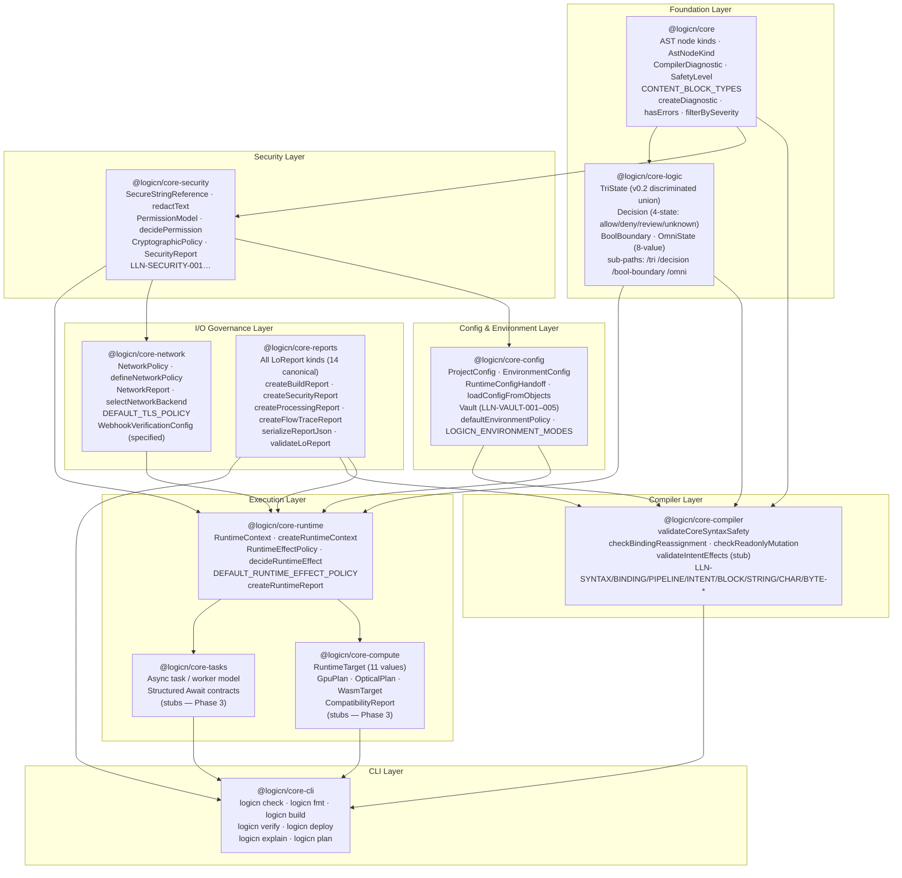
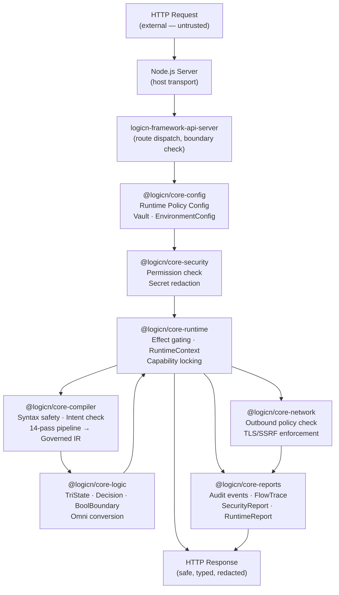
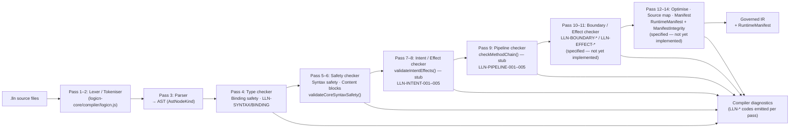

# LogicN Core Package Architecture

**Status:** Reference diagram  
**Scope:** `logicn-core*` package family — logical dependency graph and runtime data flow  
**Note:** Workspace package links (`@logicn/*` imports across packages) are pending; packages are currently standalone with types duplicated locally. These diagrams show the intended logical relationships.

---

## 1. Package Dependency Graph

The `logicn-core*` packages form a layered dependency graph: foundation types at the base, security and config above them, execution and I/O governance above those, and the CLI as the top-level orchestrator.

---

## 2. Runtime Data Flow

The current execution model is Node-hosted. LogicN governs execution through declared effects, capability checks, and policy enforcement — it does not bypass the host.

---

## 3. Compile-Time Pipeline Flow

Source `.lln` files pass through the prototype parser (Stage 1, in `@logicn/core/compiler/`) and the compiler contract layer (`@logicn/core-compiler`). The 14-pass pipeline produces Governed IR and a RuntimeManifest.

---

## 4. Diagnostic Code Namespaces

Each package owns a diagnostic namespace. The `LLN-*` format is `LLN-SERIES-NNN`.

| Prefix | Owner | Count | Status |
|---|---|---|---|
| `LLN-SYNTAX-*` | `@logicn/core-compiler` | 002 | Implemented |
| `LLN-BINDING-*` | `@logicn/core-compiler` | 004 | Implemented |
| `LLN-PIPELINE-*` | `@logicn/core-compiler` | 005 | Constants only (stubs) |
| `LLN-INTENT-*` | `@logicn/core-compiler` | 005 | Constants only (stubs) |
| `LLN-BLOCK-*` | `@logicn/core-compiler` | 004 | Implemented |
| `LLN-STRING-*` | `@logicn/core-compiler` | 004 | Constants only |
| `LLN-CHAR-*` | `@logicn/core-compiler` | 004 | Constants only |
| `LLN-BYTE-*` | `@logicn/core-compiler` | 005 | Constants only |
| `LLN-EFFECT-*` | `@logicn/core-compiler` | 004 | Specified — not implemented |
| `LLN-BOUNDARY-*` | `@logicn/core-compiler` | 004 | Specified — not implemented |
| `LLN-TRI-*` | `@logicn/core-logic` | 005 | Implemented |
| `LLN-DECISION-*` | `@logicn/core-logic` | 005 | Implemented |
| `LLN-BOOL-BOUNDARY-*` | `@logicn/core-logic` | 005 | Implemented |
| `LLN-OMNI-*` | `@logicn/core-logic` | 005 | Implemented |
| `LLN-CONFIG-*` | `@logicn/core-config` | 027 | Partially implemented |
| `LLN-VAULT-*` | `@logicn/core-config` | 005 | Implemented |
| `LLN-NETWORK-*` | `@logicn/core-network` | 008 | Specified — not implemented |
| `LLN-WASM-*` | `@logicn/core-compute` | 004 | Specified — not implemented |
| `LLN-COMPAT-*` | `@logicn/core-compute` | 004 | Specified — not implemented |
| `LLN-REPORT-*` | `@logicn/core-reports` | 005 | Specified — not implemented |
| `LLN-PROOF-*` | `@logicn/core-reports` | 005 | Specified — not implemented |
| `LLN-DENIAL-*` | `@logicn/core-reports` | 004 | Specified — not implemented |
| `LLN-EVIDENCE-*` | `@logicn/core-reports` | 004 | Specified — not implemented |
| `LogicN_RUNTIME_*` | `@logicn/core-runtime` | (open) | Implemented |
| `LogicN_SECURITY_*` | `@logicn/core-security` | (open) | Implemented |
| `LogicN_NETWORK_*` | `@logicn/core-network` | (open) | Implemented |
| `LogicN_REPORT_*` | `@logicn/core-reports` | (open) | Implemented |
| `LogicN_COMPILER_*` | `@logicn/core-compiler` | (open) | Implemented (scanner codes) |

---

## 5. Test Coverage Summary (2026-05-26)

| Package | Tests | Status |
|---|---|---|
| `@logicn/core` | 9 | All passing |
| `@logicn/core-compiler` | 20 | All passing |
| `@logicn/core-logic` | 51 | All passing |
| `@logicn/core-config` | 17 | All passing |
| `@logicn/core-security` | 14 | All passing |
| `@logicn/core-network` | 12 | All passing |
| `@logicn/core-reports` | 15 | All passing |
| `@logicn/core-runtime` | 12 | All passing |
| `@logicn/core-compute` | 5 | All passing |
| `@logicn/core-cli` | 6 | All passing |
| **Total** | **161** | **All passing** |
