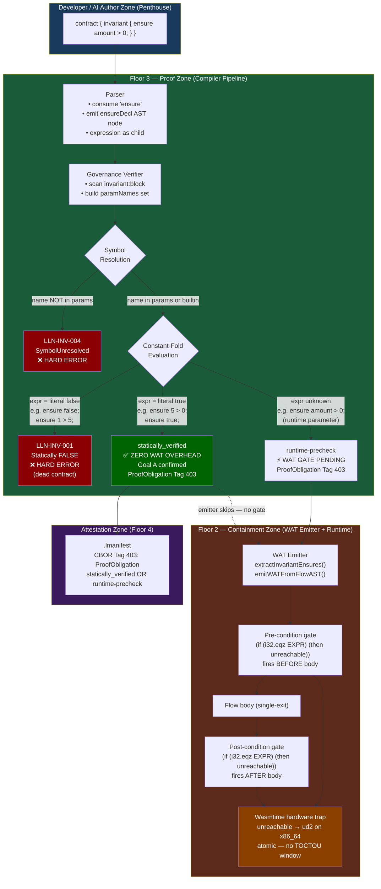
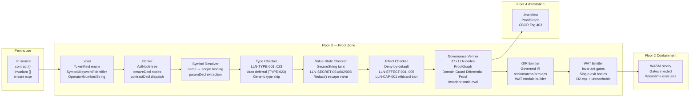

# LogicN — Floor 3: Proof Zone Graph

**Version:** 1.0 (2026-06-04)  
**Status:** Visual specification for task #69 (floor-specific dev tools graphs).  
**Purpose:** Shows every component on Floor 3 (the Proof Zone), their relationships, and — critically — the **Invariant Proof Path** that bridges Floor 3 to Floor 2 (Containment Zone).

---

## The Invariant Bridge (Focus View)

This is the most important new path added by DRCM Phase 2. It shows how `ensure expr` travels from source code to either a static proof (zero WAT) or a hardware trap gate.



---

## Complete Floor 3 Component Map

All components currently on Floor 3 (the Proof Zone), their responsibilities, and their inter-dependencies:



---

## Invariant Diagnostic Code Map

```
ensure expr;  in  invariant {}  inside  contract {}
        │
        ▼
Governance Verifier checks in order:
        │
        ├─ [1] invariant:block has no ensure children?
        │      → LLN-INV-003 ⚠️ WARNING (empty block)
        │
        ├─ [2] any identifier in expr not in paramNames?
        │      → LLN-INV-004 ❌ ERROR (symbol unresolved)
        │        prevents silent (i32.const 0) in WAT
        │
        ├─ [3] constant-fold expr = false?
        │      → LLN-INV-001 ❌ ERROR (dead contract)
        │        binary never produced
        │
        └─ [4] constant-fold expr = true?
               → statically_verified ✅
               → ProofObligation Tag 403 in .lmanifest
               → WAT emitter emits NOTHING (Goal A)

               constant-fold result = null (unknown)?
               → runtime-precheck ⚡
               → ProofObligation Tag 403 in .lmanifest
               → WAT emitter injects:
                   (if (i32.eqz EXPR) (then unreachable))
                   at function entry (pre) and exit (post)
```

---

## Single-Exit Transformation — Performance Note

**Q: Does single-exit add overhead?**

No. Cranelift JIT eliminates the boilerplate at register allocation time:

```
Before single-exit:              After Cranelift JIT:
─────────────────────            ─────────────────────
local.set $result                (eliminated — value stays in register)
br $exit                         (eliminated — direct jump to post-gate)
...                              (identical to early-return output)
local.get $result                (eliminated — register already holds value)
```

For flows with a single return path (most pure flows), the generated x86_64 assembly from single-exit WAT is **identical** to multi-return WAT. The predictability of the guaranteed post-condition check costs zero on modern CPUs with Cranelift.

The micro-overhead only materialises for flows with 3+ early return paths in deeply nested if/else trees. Even then, it is sub-nanosecond per call — irrelevant compared to the semantic guarantee it provides.

---

## Decimal / Runtime Function Invariants (Phase 3 Strategy)

For invariants that can't be expressed in WAT integer arithmetic (e.g., `ensure decimal.credits == decimal.debits`), the Phase 3 strategy uses an imported helper per the document's "Panic Helper" suggestion:

```wat
;; WASM module import (Phase 3+)
(import "logicn" "check_invariant_fn" (func $check_fn (param i32) (result i32)))

;; Assertion gate
(if (i32.eqz (call $check_fn (local.get $context_ptr))) (then unreachable))
```

The `logicn::check_invariant_fn` host import evaluates the Decimal comparison in the host runtime (where arbitrary-precision is available), returns 1 (pass) or 0 (fail). The WAT stays simple; complexity lives in the host. This keeps the emitter dumb and matches the architecture of WASI imports.

---

## Cross-References

| Topic | Document |
|---|---|
| Full invariant {} implementation | `packages-logicn/logicn-core-compiler/src/governance-verifier.ts` |
| WAT gate injection | `packages-logicn/logicn-core-compiler/src/wat-emitter.ts` |
| DRCM Phase 2 task | `logicn-build-roadmap.md` (#36 ✅) |
| Floor-specific graph tool | Task #69 |
| Platform infographic concept | `logicn-platform-infographic-concept.md` |
| Governed Tower floor definitions | `logicn-platform-infographic-concept.md` |
