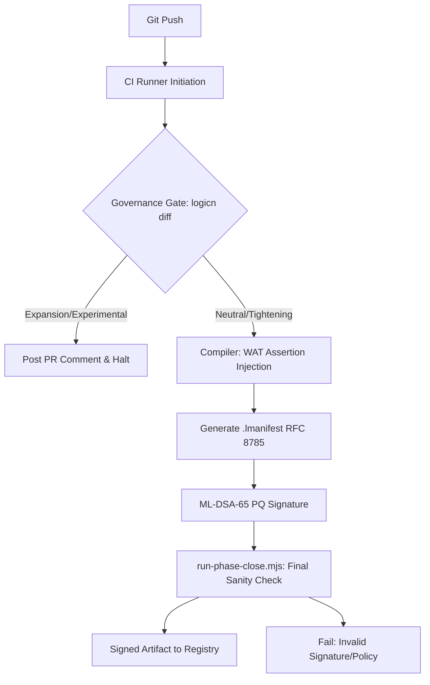

# LogicN — Governance-First CI/CD Pipeline

**Version:** 1.0 (2026-06-04)  
**Source:** notes/26-cidi  
**Status:** Architecture document — partially implemented; remaining items in task list.

---

## Core Principle

> The CI/CD pipeline is not a build tool. It is a **cryptographic attestor** and **governance enforcer**.

LogicN CI/CD transforms from "Pass/Fail" to "Risk-Based" gating:

| Change Class | CI/CD Action | Gate |
|---|---|---|
| **Neutral** | Auto-proceed | 1 reviewer |
| **Tightening** | Auto-proceed | 1 reviewer + automated checks |
| **Expansion** | Hard block → Governance Review required | 2 reviewers including security owner |
| **Experimental** | Flag → Verify `@experimental_profile` branch | Architecture review |

**What's implemented today:**
- `logicn diff` with change-class output (exit 0/2/3)
- `governance:diff` in `run-phase-close.mjs` (standing sanity check)
- `.lmanifest` RFC 8785 canonical JSON output on `logicn build`
- GitHub Actions governance review workflow (`.github/workflows/governance-review.yml`)
- PR template with change-class checklist

---

## 1. CI/CD Initiation Schematic



### Phase 1: Pre-Flight (The Governance Handshake)

```
git push
  → CI pulls /governance/ root policy
  → logicn diff --against main
  → classify change: neutral | tightening | expansion | experimental
```

### Phase 2: Compilation Gate (Evidence Generation)

Only if `neutral` or `tightening`:
```
logicn build <file.lln>
  → WAT assertion injection (inlined governance checks)
  → .lmanifest generated (RFC 8785 canonical JSON)
  → ML-DSA-65 signature over manifest body hash
```

### Phase 3: Final Gate (`run-phase-close.mjs`)

```
run-phase-close.mjs
  → tests:core           (compiler + stage B)
  → tests:patterns       (8 architecture patterns)
  → tests:goals          (T-006/007/008)
  → governance:diff      (logicn diff HEAD~1 — standing sanity check)
  → audit:security       (secret taint, value-state)
  → graph:reindex        (2852+ nodes)
```

---

## 2. Repository Layout (Governance-as-Code Structure)

```
/project
├── /flows              ← Business execution logic (*.lln)
├── /governance         ← Immutable policy definitions (InvoicingGuard.lln, etc.)
│   └── root.lln        ← Root Policy — first commit, signed by master key
├── /contracts          ← Local contract bindings [conforms_to: /governance/...]
├── /tests
│   ├── /patterns       ← 9 architecture pattern examples (verified)
│   └── /goals          ← T-006/007/008 acceptance tests
├── /scripts
│   └── run-phase-close.mjs  ← The "Final Gate" CI script
└── .lmanifest.lock     ← Cryptographic proof of current system posture
```

**Why this separation?** An AI agent proposing a change finds `/governance/` before touching `/flows/`. It checks if a policy already exists before proposing a contract expansion — preventing the most common AI privilege escalation pattern.

---

## 3. The Development Loop (Proposal-Then-Verify)

For both human developers and AI agents:

```
1. Draft:    Modify a flow in /flows and its local contract {}
2. Dry run:  logicn check --diff (local — see change class before pushing)
3. Propose:  If expansion needed, update /governance policy
4. CI gate:  logicn diff auto-runs, posts Governance Summary to PR
5. Review:   Security owner reviews if expansion; arch review if experimental
6. Sign:     .lmanifest signed only after governance gate passes
```

---

## 4. Key Implementation Watch-Outs

### The Bootstrap Problem

The **first commit** in any LogicN project must be the Root Policy (`governance/root.lln`), signed by a physical offline master key. Every subsequent PR is checked against this root. Without this, the first expansion PR has no ceiling to check against.

### Manifest Signing as the Final Gate

**No cryptographic evidence (`.lmanifest`) is ever generated for a build that violates governance.** If a developer manually edits the binary after compilation, the LogicN runtime immediately detects the invalid `.lmanifest` signature and refuses execution.

This creates an unbreakable chain:
```
Governance-clean source → .lmanifest signed → DSS.wasm validates manifest → execute
```

If ANY link breaks, execution is denied at the hardware trap level.

### Governance Diff Scope

The `logicn diff` command must check BOTH:
1. `/flows/` code changes (contract declarations)
2. `/governance/` policy changes (policy ceilings)

A common exploit: tighten a flow's contract while simultaneously loosening the global policy to allow the expansion. The diff must detect the simultaneous change.

### Telemetry/Observability Security

The `observability {}` block MUST be blocked from accessing variables in the `privacy {}` scope. The Governance Verifier must treat these as distinct memory domains — telemetry can track latency/throughput/error rates but NEVER raw input/output payloads containing PII.

### resilience {} + DPM Synchronisation

When `quarantine_after` threshold is hit, the resilience engine MUST signal the DSS supervisor. The DSS immediately zeros the 32-bit V_DPM bitmask for that isolate — physically preventing further effects until an administrator resets posture via an out-of-band management key.

---

## 5. Governance Impact Artifact

Every CI run should produce a `governance-impact.json` file capturing the security surface area of the PR:

```json
{
  "changeClass": "expansion",
  "deltaFlows": [
    {
      "name": "processPayment",
      "effectsAdded": ["network.outbound"],
      "effectsRemoved": [],
      "qualifierBefore": "secure",
      "qualifierAfter": "secure",
      "policyViolation": "network.outbound not in permitted_effects of InvoicingDomainGuard"
    }
  ],
  "limitsChanged": [],
  "economicsChanged": [],
  "resilienceChanged": [],
  "observabilityChanged": []
}
```

**Use in AI-assisted development:** The `governance-impact.json` becomes a "system prompt" for AI agents reviewing their own proposals. The agent can self-assess before committing:
> "This PR is classified as Expansion. It adds network.outbound to processPayment. This violates InvoicingDomainGuard. To fix: request policy update in /governance/invoicing_guard.lln."

**Pending implementation:** Task #63 (governance-impact.json artifact generation)

---

## 6. Future Technology Positioning

LogicN's Governance-as-Compute model directly enables:

| Technology | How LogicN enables it |
|---|---|
| **Fully Homomorphic Encryption (FHE)** | Deterministic, bounded flows compile to FHE-compatible arithmetic circuits. `invariant {}` proofs become circuit constraints. |
| **Autonomous Agentic Networks** | V_DPM bitmask as unforgeable identity token. Agent B validates Agent A's capability token before any cross-agent call. |
| **Post-Quantum Secure Edge** | ML-DSA-65 signatures ensure secure deployment to satellite/critical infrastructure even under quantum adversary. |
| **Zero-Knowledge Proof Audits** | `invariant {}` + Governance Verifier static analysis can emit zk-SNARKs proving "payment processed correctly" without revealing data. |
| **Multi-Party Computation (MPC)** | `contract {}` + `effects {}` ensure all MPC cluster nodes run identical, verified WASM bytecode — no participant can deviate. |
| **Confidential Cloud (TEE)** | DSS.wasm is designed as the minimal TCB for Intel SGX / AMD SEV-SNP deployment. "Double-locked" compute — hardware guarantees CPU, LogicN guarantees application logic. |
| **AI Agent Governance** | Agents can propose code changes; pipeline acts as "governance governor" — prevents AI drift where agents give themselves incremental permissions. |
| **Self-Healing Infrastructure** | `resilience {}` + `observability {}` telemetry triggers autonomous state-transitions. `ProofGraph` determines safe degradation path without human intervention. |

---

## 7. Pending Tasks

| Task | Description |
|---|---|
| #63 | Generate `governance-impact.json` artifact for every build/PR |
| #64 | `logicn check --diff` — local dry run showing change class before push |
| #65 | `logicn init-env` — validate branch capabilities against root governance policy |
| #66 | Telemetry/privacy separation check in governance verifier (observability cannot access privacy scope) |
| #67 | DSS V_DPM quarantine signal from resilience engine (DRCM Phase 5 dependency) |

---

## Cross-References

| Topic | Document |
|---|---|
| Change-class rules | `logicn-governed-design-synthesis.md` |
| Domain guard policies | `logicn-domain-guard-policies.md` |
| .lmanifest generation | `packages-logicn/logicn-core-compiler/src/manifest-generator.ts` |
| GitHub Action | `.github/workflows/governance-review.yml` |
| Engineering goals | `logicn-engineering-goals.md` |
| Phase-close script | `scripts/run-phase-close.mjs` |
