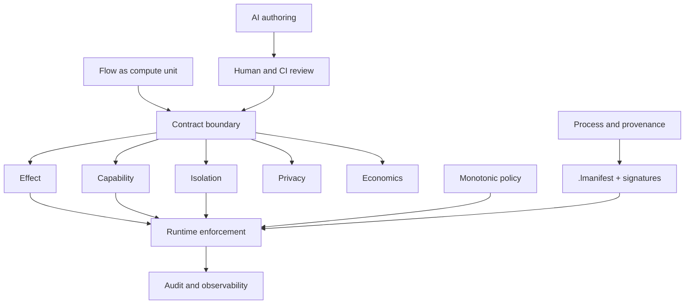
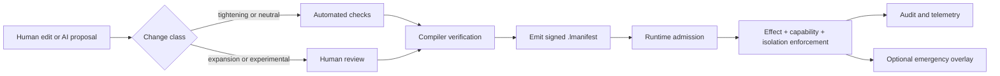

# LogicN — Governed Design Synthesis

**Version:** 1.0 (2026-06-04)  
**Source:** notes/25-deep-research-report.md  
**Status:** Knowledge base reference — findings to inform future design. Do not divert current implementation work; add new items as tasks.

---

## Core Design Frame

> **Flows** are the chainable unit of compute. **Contracts** are the governance boundary around each unit.

- The compiler proves what it can before execution
- The runtime enforces what remains via imports, capabilities, limits, and isolation
- The delivery process signs and records what was built

---

## Two Distinct "Policy" Concepts

**This is the most important naming disambiguation in the LogicN design:**

| Concept | Syntax | Location | Purpose |
|---|---|---|---|
| **Domain Guard Policy** | `policy DomainName { permitted_effects {} enforced_limits {} }` | External file in `governance/policies/` | Immutable ceiling. Referenced via `[conforms_to: X]` on `contract {}`. See `logicn-domain-guard-policies.md`. |
| **Emergency Policy Overlay** | `policy { emergency { on X { deny Y } } }` | Inline block between `contract {}` and `{ body }` | Runtime monotonic security overlay. Per-flow. DRCM Phase 4. |

---

## 8-Category Mapping

| Category | LogicN section(s) | Compiler | Runtime | Enforcement |
|---|---|---|---|---|
| Syntax | `flow`, `contract {}`, block grammar | Parse, desugar, name resolution | Consume metadata | Compile-time + human |
| Contract | `types`, `intent`, `request`, `response` | Validate schema, type-check | Bind shapes, expose to audit | Compile-time + runtime |
| Effect | `effects {}`, `audit {}` | Deny-by-default checking, call-graph propagation | Capability mediation, receipts | Compile-time + runtime |
| Capability | `authority {}`, `secrets {}` | Explicit declarations, taint | Mint/validate tokens, resolve handles | Compile-time + runtime + human |
| Isolation | `targets {}`, `limits {}`, backend | Validate backend, reject unsafe imports | Sandbox, cap memory/time/fuel | Mostly runtime |
| Monotonic | `invariant {}`, emergency overlay | Verify shrink-only transitions | Pre/post checks, apply tighter authority | Compile-time + runtime + human |
| AI Authoring | `intent {}`, `.logicn.proposal` | Parse proposals, re-run static checks | Reject unreviewed artefacts | Human first; compile-time second |
| Process | `.lmanifest`, ProofGraph, GovernanceSignature | Sign provenance, emit manifest | Admission checks, receipt emission | CI/CD + runtime admission |

---

## 9 Missing Categories

These should become explicit design categories — most need dedicated KB docs and tasks:

| Category | Why explicit? | Best home in LogicN | Task |
|---|---|---|---|
| **Security** | Umbrella for trust boundaries, unsafe bans, hardening defaults | `security {}` section or umbrella over `authority`, `secrets`, `targets`, emergency overlay | — |
| **Privacy** | Lawful data use, redaction, sink restrictions | `privacy {}` + value-state/taint checker + manifest export | — (already exists) |
| **Economics** | Separate acceptable spend from pure safety limits | `economics {}` + runtime metering | — (already exists) |
| **Resilience** | Timeout, retry, fallback, degradation, quarantine | `resilience {}` + runtime scheduler + host policy | #58 |
| **Observability** | Operator telemetry DISTINCT from evidentiary audit | `observability {}` / `telemetry {}` alongside `audit {}` | #58 |
| **Testing / Verification** | Invariants, proofs, conformance as first-class | `invariant {}` + conformance corpus | #36 (DRCM Phase 2) |
| **Tooling / Change Management** | Proposal files, lints, diagnostics, autofixes | `.logicn.proposal`, linter, CI policy | #59 |
| **Backends / Interop** | Backend changes isolation, determinism, ABI | `targets {}` + backend profiles | — |
| **Provenance / Attestation** | Connect build evidence to runtime admission | `.lmanifest`, signatures, transparency logging | #37 (DRCM Phase 3) |

**Key separation principle:**
- `limits {}` = can this run safely?
- `economics {}` = is the cost acceptable?
- `resilience {}` = how does this degrade when edges are hit?

These are three separate questions requiring three separate blocks. Do not merge them.

---

## Change-Class Review Workflow

Every contract change is classified by risk — the review gate scales accordingly:

| Change class | Examples | Required gate |
|---|---|---|
| **Tightening** | Fewer effects, stricter privacy, smaller limits, narrower targets | 1 reviewer + automated checks |
| **Neutral** | Documentation, refactors with no manifest delta | 1 reviewer |
| **Expansion** | New effects, new secrets, broader authority, larger budgets | 2 reviewers including security/governance owner |
| **Experimental policy or backend** | Emergency overlay, native backend, new runtime capability classes | Architecture review + conformance rerun + signed release |

This workflow is implemented via PR templates and CI lint (task #59).

---

## Stage B Priorities (Research Recommendation)

In order of importance — front-load enforceable essentials, delay novelty:

1. **Freeze minimal contract surface** — stable parsing for all 16 contract sub-blocks; `invariant {}` and `policy { emergency {} }` behind `@experimental_profile`
2. **Make deny-by-default compile-time enforcement real** — type checking, effect checking, privacy/value-state, secret-sink
3. **Wasm-first runtime capability broker** — Wasmtime + Component Model, explicit imports, fuel-based interruption
4. **Emit signed `.lmanifest` early** — source hash, effects, secrets, privacy constraints, backend, signer identity
5. **AI authoring via proposal workflow** — `.logicn.proposal` artefact, risk classification, human approval for expansions
6. **Add `resilience`, `observability` while surface is small** — easier now than after contracts ossify
7. **Keep early invariants lightweight** — runtime-checkable expressions; no theorem prover requirement
8. **Zig/native backend last** — Wasm parity first, then narrow experimental native backend

---

## Source Priority Order

1. Official LogicN artefacts (design notes, compiler test suite, KB docs)
2. Runtime/isolation baselines (WebAssembly Component Model, Wasmtime, WASI OTel)
3. Verification + information-flow (SPARK, Jif/JFlow)
4. Authorisation comparators (Cedar — expressive + safe + analysable; OPA — decoupled decision engine)
5. Capability + provenance (CHERI — unforgeable tokens + monotonic authority; SLSA + Sigstore — build provenance)

---

## Cross-References

| Topic | Document |
|---|---|
| Domain guard policies | `logicn-domain-guard-policies.md` |
| DRCM runtime architecture | `logicn-deterministic-runtime-containment.md` |
| Governance rules (14 categories) | `logicn-governance-rules.md` |
| Architecture patterns | `logicn-architecture-patterns.md` |
| Engineering goals | `logicn-engineering-goals.md` |
| Deep research (Cedar/OPA/etc.) | `logicn-governed-runtime-research-2026-06-03.md` |
